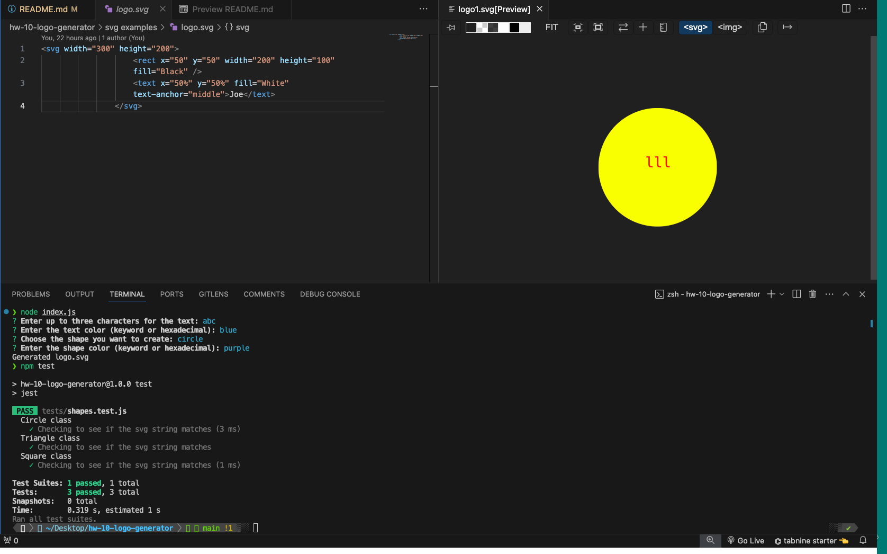

# hw-10-logo-generator

  ## Description
  * Use the inquirer package to prompt the user for answers to create a unique logo! 
  * Generate an SVG image in the form of a triangle, circle, or square with text inside up to 3 characters and choose your own colors!
  * Run a test suite to test if the svg string matches.
  * Here is a view of what the terminal will look after running the commands and an example svg generated. 

  
  
  ## Table of Contents
  * [Installation](#installation)
  * [Usage](#usage)
  * [Contributing](#contribution)
  * [Tests](#tests)
  * [Questions](#questions)
  
  ## Installation

  To install necessary dependencies, run the following command:

  * npm i
  
  ## Usage
  * A Mac or PC with a terminal. Common examples are Zsh for Mac and Bash for Windows.
  * Once you navigate to the correct integrated terminal run the command node index.js to start the prompts. 

  ## Contributing
  * Create a pull request
  
  ## Tests

  To run tests, run the following command:

  * npm test

  ## License
   

This project is unlicensed. 

  
  ## Questions
  * Here is a link to my [GitHub](https://github.com/soko77788) profile.
  * For further questions email me at nicksoko@gmail.com.

  ## Tools and 3rd party assistance
  * Influenced with the week 10 OOP miniproject code along and Instructor demo in office hours starting in week 11. 
  * Screencastify
  * Student AI tool and ChatGPT for SVG dimensions and assistance navigating between common js and ES6 imports. 

  ## Obstacles and Successes
  * The biggest obstacle was getting the inquirer package and jest tests to both work. Installing an older inquirer package was the answer.
  * Importing information from one js file back to the main index.js file
  * Using Screencastify for the 2nd time and getting it uploaded on google drive

  * Creating the objects wasn't too difficult, but finding the right SVG dimensions for each shape was tricky. 
  * Screencastify was already installed so getting the recording down reading the docs was great. 

  ## Video Demo Link

https://drive.google.com/file/d/1bZEXALI_VwKr0tdS8m--rI7wYhV9Mmkj/view